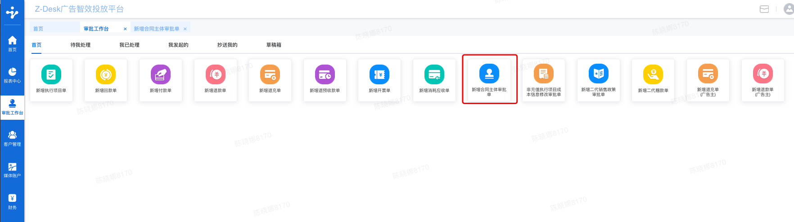

# 新增合同主体审批单

## 1、功能说明 

新增合同主体审批单：在系统中增加合作（打款）客户的信息，在增加合同主体信息之后，才能进行后续流程的提交

## 2、进入路径 

审批-审批工作台-新增合同主体审批单


新增合同审批单链接


## 3、填写标准 

### （1）基本信息&填写标准 

**合同主体名称：**填写合作协议上的主体全称，例”冰希黎（上海）国际贸易有限公司 “

**单据类型-新增/编辑合同**主体：可进行勾选，如勾选新增合同主体，则可以录入一个新的合同主体的相关信息；如勾选编辑合同主体，则是对系统中已有的合同主体信息进行编辑。


只允许对合同主体进行关联变更，如合同主体更名等，不允许将合同主体修改为一个完全不同的合同主体


**地理位置**：根据合同主体具体归属地进行下拉选择，请精确到市区

**归属区域**：根据合同主体地理位置自动带出

**合同主体性质**：按合作的合同主体分直客/渠道进行下拉选择

直客&渠道定义参考文档：

**业务线**：根据与合同主体初步沟通的合作业务线进行选择，可多选，对后续业务无影响，仅做参考

**商务人员**：可多选，填写目前此合同主体合作的商务


对应商务可收到该合同主体回款通知邮件，可在回款认领处进行回款认领，提交回款单


**商务归属部门**：根据商务人员自动带出

**抄送人员**：默认抄送CEO、法务、风控、财务管理中心、直属部门主管、归属部门主管、直属部门支持、归属部门支持，如需增加其他人员可直接进行搜索增加


对应抄送人可在回款认领处进行回款认领，提交回款单


### （2）授信及账期&填写标准 

新增/编辑业务信息：可进行勾选，如勾选填写后则会进入审批流程，如不勾选新增/编辑业务信息，可直接提交后续再进行信息补充，才会进入审批流程，但如无业务信息则无法提交后续流程。付款方式：根据此客户是否给予正常授信账期进行选择 垫付&预付付款条款：根据与此合同主体约定的回款条款进行填写，可直接引用合作协助中对应条款开票税率：根据与合同主体约定的税率进行填写

#### 预付客户： 

否开启临时垫款：针对预付客户的临时垫款需求直客性质客户：临时垫款池总额90W，默认垫款账期7天，7天到期后则无法继续使用垫款额度，系统自动恢复至预付客户状态，如无预付款则无法充值；渠道性质客户：临时垫款池总额600W，默认垫款账期1天，1天到期后则无法继续使用垫款额度，系统自动恢复至预付客户状态，如无预付款则无法充值.预付类型

#### 垫付客户： 

额度分级：根据法务出具的分级标准结合客户实际需求进行选择是否引用授信主体：如以后授信额度，则无法再申请引用其他授信主体的额度授信额度：根据需要申请的授信额度填写授信账期：根据需要申请的授信账期填写额度申请日期：默认当前日期额度调整：下拉选择是新增额度还是上调额度单笔垫款毛利：根据财务提供的毛利计算公式算出填入最高垫款额度：根据额度分级确定最高垫款金额，申请金额不超过分级的最高金额预计年度资金收益率%:根据单笔垫款毛利、最高垫款额度对应公式自动计算申请额度原因：根据客户实际原因填写参考以下：《垫款客户管理指引》、《资金收益率计算模板》垫付类型

### （3）广告预算及历史合作 

产品名称：根据提前录入的产品列表下拉选择z-办公桌广告主&品牌维护链接广告主、品牌维护规则参考以下《系统信息维护规则》广告主、品牌维护仅限业务线支持操作客户返点比例：根据真实的返点比例填写客户年广告投放预算：根据客户需求填写客户分配至我司的预算：根据客户需求填写历史回款情况：根据客户历史合作情况填写，可找财务查询

### （4）客户概况 

成立日期：根据营业执照上实际情况填写注册资本/实收资本：根据客户实际情况填写客户性质：根据客户实际情况填写客户来源：根据客户实际情况填写法人姓名、法人身份证号：根据客户实际情况填写统一社会信用代码：根据客户实际情况填写营业执照图片上传：必填项

### （5）行业、地位及背景 

参考垫款客户管理指引

### （6）尽调 

参考垫款客户管理指引

### （7）开票信息 

地址、电话、开户银行、开户银行账号、票据类型、开票内容：根据此客户签署合同中约定的信息填写。

## 4、审批流程及节点 

根据是否预付客户，是否临时垫款，是否渠道客户，是否引用授信主体的条件，审批流程不同垫付客户-未引用授信主体额度的，根据风控判断是否为特殊垫款，需业务提交人上传相应附件参考垫款客户管理指引、邮件模板

新增合同主体审批节点






